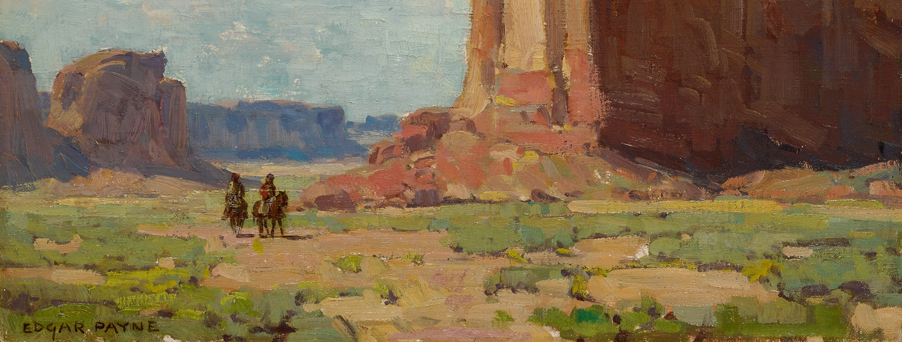

A cropped version of *Canyon De Chelley* by Edgar Alwin Payne.

**NOTE**: My website is undergoing reconstruction and the new version will be live before 29th November, 1 PM PST.

## 👋 Bio
I am developing [Nudge](https://givemeanudge.com/) (voice agent that helps users build habits and tackle lingering tasks) while actively exploring opportunities in AI data infrastructure, safety systems, or hard tech. Please reach out if you are building in these spaces!

📫 You can check out my [LinkedIn profile here](https://www.linkedin.com/in/satpathyakash/).

### 👾 A few illustrative projects:
1. [knightsGPT](https://github.com/AsteroidHunter/knightsGPT): Can a GPT-2 variant trained on millions of games *learn* how to solve the knight's tour puzzle? (Spoiler: yes!)
2. [replicatingAlexnet](https://github.com/AsteroidHunter/replicatingAlexnet): PyTorch-based replication of the classic computer vision paper, [Krizhevsky et al. (2012)](https://proceedings.neurips.cc/paper_files/paper/2012/file/c399862d3b9d6b76c8436e924a68c45b-Paper.pdf).
3. [Thermal modeling of (99942) Apophis](https://iopscience.iop.org/article/10.3847/PSJ/ac66d1): We used non-linear optimization and a markov chain monte carlo algorithm to constrain the physical properties of the near-Earth asteroid (99942) Apophis. [Other publications here.](https://scholar.google.com/citations?user=WGDJUkoAAAAJ&hl=en)
4. [Tucson Effective Altruism](https://linktr.ee/tea_at_ua): An organization I co-founded and scaled. Our improved capacity enables us to run a university course, upskilling programs, research-styled symposia, and weekly community events.

<!--
**AsteroidHunter/AsteroidHunter** is a ✨ _special_ ✨ repository because its `README.md` (this file) appears on your GitHub profile.

Here are some ideas to get you started:

- 🔭 I’m currently working on ...
- 🌱 I’m currently learning ...
- 👯 I’m looking to collaborate on ...
- 🤔 I’m looking for help with ...
- 💬 Ask me about ...
- 📫 How to reach me: ...
- 😄 Pronouns: ...
- ⚡ Fun fact: ...
-->
